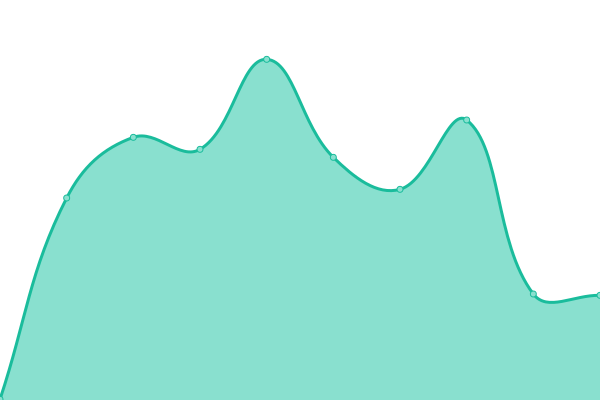
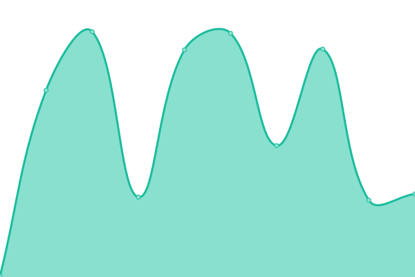

# [📈 Live Status](https://phpbb.github.io/status-site): <!--live status--> **🟧 Partial outage**

This repository contains the open-source uptime monitor and status page for [phpBB Forum Software](https://www.phpbb.com), powered by [Upptime](https://github.com/upptime/upptime).

With [Upptime](https://upptime.js.org), you can get your own unlimited and free uptime monitor and status page, powered entirely by a GitHub repository. We use [Issues](https://github.com/phpbb/status-site/issues) as incident reports, [Actions](https://github.com/phpbb/status-site/actions) as uptime monitors, and [Pages](https://phpbb.github.io/status-site) for the status page.

<!--start: status pages-->
<!-- This summary is generated by Upptime (https://github.com/upptime/upptime) -->
<!-- Do not edit this manually, your changes will be overwritten -->
<!-- prettier-ignore -->
| URL | Status | History | Response Time | Uptime |
| --- | ------ | ------- | ------------- | ------ |
|  [phpBB.com](https://www.phpbb.com) | 🟥 Down | [php-bb-com.yml](https://github.com/phpbb/status-site/commits/HEAD/history/php-bb-com.yml) | 

 308ms
     
 | 

<a href="https://status.phpbb.com/history/php-bb-com">99.74%</a>
    

|  [Area51](https://area51.phpbb.com) | 🟥 Down | [area51.yml](https://github.com/phpbb/status-site/commits/HEAD/history/area51.yml) | 

 233ms
     
 | 

<a href="https://status.phpbb.com/history/area51">99.75%</a>
    

|  [Tracker](https://tracker.phpbb.com) | 🟥 Down | [tracker.yml](https://github.com/phpbb/status-site/commits/HEAD/history/tracker.yml) | 

 391ms
     
 | 

<a href="https://status.phpbb.com/history/tracker">99.75%</a>
    

|  [Versioncheck](https://version.phpbb.com) | 🟩 Up | [versioncheck.yml](https://github.com/phpbb/status-site/commits/HEAD/history/versioncheck.yml) | 

 212ms
     
 | 

<a href="https://status.phpbb.com/history/versioncheck">99.85%</a>
    

|  [Blog](https://blog.phpbb.com) | 🟥 Down | [blog.yml](https://github.com/phpbb/status-site/commits/HEAD/history/blog.yml) | 

 7228ms
     
 | 

<a href="https://status.phpbb.com/history/blog">99.75%</a>
    

|  [Downloads](https://download.phpbb.com) | 🟩 Up | [downloads.yml](https://github.com/phpbb/status-site/commits/HEAD/history/downloads.yml) | 

 211ms
     
 | 

<a href="https://status.phpbb.com/history/downloads">99.87%</a>
    

|  Demo | 🟩 Up | [demo.yml](https://github.com/phpbb/status-site/commits/HEAD/history/demo.yml) | 

 5385ms
     
 | 

<a href="https://status.phpbb.com/history/demo">99.77%</a>
    

<!--end: status pages-->

[**Visit our status website →**](https://phpbb.github.io/status-site)

## 📄 License

- Powered by: [Upptime](https://github.com/upptime/upptime)
- Code: [MIT](./LICENSE) © [phpBB Forum Software](https://www.phpbb.com)
- Data in the `./history` directory: [Open Database License](https://opendatacommons.org/licenses/odbl/1-0/)
